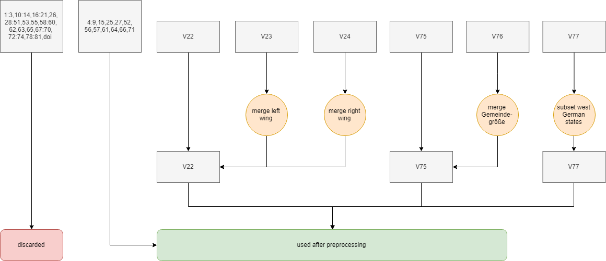

```{r setup, include=FALSE}
knitr::opts_chunk$set(echo = TRUE)
```


## Topics of discussion
This analysis was performed and documented as a project in the *Data Mining* as part of the *Machine Learning and Data Mining* curriculum at *Université Jean Monnet*.

The main question that is supposed to be answered in this work is whether or not the political opinion in Germany experienced a tonal shift after the German reunification in the year 1990 in the short and in the long run. Moreover, this analysis choses to focus on West German federal states. While the causal effect and repercussions in Eastern German states are contentious and well researched, the same cannot be said about issues regarding only the Western German part of the country. This question is mainly to be answered in a data-driven fashion, i.e. by analysing and transforming at raw data and drawing conclusions from this analysis, rather than second hand accounts and literature. Since the question posed is multifacetted and can be answered in various equally acceptable ways, the following analysis focuses on the following indicators which highlight things about the political climate in Germany.

1) The immediate reaction after the fall of the Berlin Wall in 1989 and the reunification in October of 1990.

2) The general trend of left-wing vs center vs right-wing association across time.

3) Regional differences of political tendencies.

4) Predictiveness of voting behavior based on other factors.

It is believed that by merging information indicating political trends and culture in Germany using a wide variety of methods, the analysis is able to find synthesis on the topic.

## About the dataset

```{r echo=FALSE, message=FALSE, warning=FALSE}
library(haven)
library(dplyr)
ZA2391_v9_0_0 <- read_sav("C:/Users/fwalo/Documents/R Projects/ElectionPolling/data/ZA2391_v9-0-0.sav");
dataset <- ZA2391_v9_0_0;
source("C:/Users/fwalo/Documents/R Projects/ElectionPolling/code/preprocessing.R")
dset = preprocessing(dataset)
```

The dataset used in this study was created and provided by the research group *Wahlen* (@gesis), on behalf of *ZDF*, a publicly funded German broadcasting station. The dataset consists of surveys containing questions about social facts, electoral intent and political affiliation of German citizens. The survey was conducted via the phone and spans across a timeframe of 41 years between 1977 and 2017. The questionaire used was kept relatively the same across the years, every time a question was changed, discarded or adjusted, the change was noted.
The dataset consists of 82 variables, among others the age and livelihood of the person, their opinion about the current state of politics and economy in Germany, and their last and prospected electoral vote for federal elections.

Out of these 82 variables, 24 variables were hand-selected for this analysis based on their assumed relevancy for the questions at hand. The full list of variables and a short description for each of them can be found in Appendix A. Furthermore a full description of all variables used in the dataset can be found on the website of the GESIS foundation (@gesis). 


## Data cleaning, preprocessing

The data was prepared uniformly for all further processing steps in the following way.
First, the variables *v22*, *v23*, *v24* containing information about the subjects stance in a left-right-paradigm, their left-wing tendencies and their right-wing tendencies respectively, were merged into one variable. The variables *v23* and *v24* were used from 1989 to 1996 instead of *v22* to ask the subject for their political tendencies. In these years, the person was first asked whether or not they identify themselves left-wing, right-wing or center, if they answered either left- or right-wing, the surveyor then asked for their belief intensity from a scale of 1 to 5. In comparison, in all other years, the subject was asked how they would place themselves in a left-right spectrum on a scale from 1 (meaning very left-leaning) over 6 (meaning neither left- nor right-leaning) to 11 (meaning very right-leaning). The structure and scaling of the responses thus lend themselves to be merged for further analysis. It is assumed that the rephrasing of the question does not introduce a significant bias into the results.

Secondly, the variables *v76* and *v77* were also merged. The question posed in *v76* was phrased to get the number of people living in the subjects *locality* (Ortsgr&ouml;&szlig;e) which the question posed in *v77* which was used from 2011 to 2017 asked about the size of the *municipality* (Gemeindegr&ouml;&szlig;e). In coloquial German, both terms are interpreted very similarly. Because of this, it was decided to merge these two variables. In this process, the difference in ranges was taken into account and changed accordingly (e.g. the range 5-10k inhabitans was merged with the range 5-20k inhabitants in *v77*).

Lastly, since this analysis only concernes itself with Western German opinions, we discard all subjects which say to reside in eastern German federal states. Furthermore, the data collected from West-Berlin was ommited for this analysis.

The remaining 21 variables were then used for all further analysis. The following diagram visualizes the process.



## Modeling and Evaluation

The modeling was done in multiple parts to deal with all the above mentioned points respectively.

1) The immediate reaction after the fall of the Berlin Wall in 1989 and the reunification in October of 1990.

In order to find out what the general populace thought about the way that the reunification was dealt with by the government and their overall approval, the elections of 1990 and the preceding federal election in West-Germany of 1987 were looked at. More specifically, the gross number an indicator of how much opinion changed is the gross number of people who decided to switch parties during this election, especially away from the ruling party of the time (a coalition of the christian-conservative party CDU and the liberal party FDP).

The results of this are shown in the ribbon plot below.

```{r echo=FALSE}
c1 = dataset[!is.na(dataset["v7"])&!is.na(dataset["v6"])&dataset["v4"]==1990,][,c("v7","v6")]

switch_mat = matrix(0L, nrow = 12, ncol = 12) 
for(i in 1:12){
  for(j in 1:12){
    norm_coeff = dim(as.vector(c1[c1["v6"]==j,]["v6"]))[1]
    switch_mat[i,j] = dim(as.vector(c1[c1["v7"]==i&c1["v6"]==j,"v7"]))[1]/norm_coeff
  }
}
parties = labels(attributes(dataset$v6)$labels);
#devtools::install_github("mattflor/chorddiag")
library(chorddiag)
groupColors <- c('blue','black','red','brown','yellow','green')
sm2 = switch_mat[c(1,2,3,4,6,8),c(1,2,3,6,4,8)]
dimnames(sm2) <- list(have = parties[c(1,2,3,6,4,8)],
                      prefer = parties[c(1,2,3,6,4,8)])
chorddiag(t(sm2), groupColors = groupColors)
```

The ribbon plot was created using a custom plot (@zoonekynd_2019), it shows the following features. The colors at the rim of the circle represent the color associated with the outside mentioned party, the inner ribbon show the change in voting behavior as percentage of all voters in the receiving party for the election in 1990. The ribbons are bidirectional but the color refers to the bigger directional influence. For example, a big yellow ribbon coming from *FDP* to *Republicaner* means that about 50% of the voters in the election came from people who voted *FDP* in the last election.
As can be seen, a lot of changes between parties happened. The newly found hard-right party *Republikaner* gained their votes mainly from the ruling parties of the time *CDU* and *FDP*. On the other hand, a not-insignificant part of undecided voters (named as *nicht erhoben*) voted for the main social democrat oposition party SPD.
These are already indicators that immediate reaction after the vote were not uniformly positive.

2) The general trend of left-wing vs center vs right-wing association across time.

In order to find out the trend of political affiliation regardless of party association, the self reported stance of political leaning in the "left-right-continuum" was looked at. More specifically, the item of interest was the percentage of people associating with left wing ideologies, right wing ideologies or centrist points of view. This set of values was calculated for each year where data was available and compared.

```{r echo=FALSE, message=FALSE, warning=FALSE, paged.print=FALSE}
years22 = c(1987:1993)
stacked = matrix(0L, nrow = length(years22),ncol = 11);
for(idx in 1:length(years22)){
  vals = table(na.omit(dset[dset["v4"]==years22[idx],"v22"]))
  for(idx2 in names(vals)){
    stacked[idx,as.numeric(idx2)] = vals[idx2]
  }
}
library(RColorBrewer)
coul = brewer.pal(11, "RdBu") 
stacked = as.data.frame(stacked)
stacked = t(apply(stacked,1,function(x){x*100/sum(x)}))
rownames(stacked) = years22
barplot(t(stacked) , col=rev(coul), border="white",xlab="left-to-right-leaning (% of total)",
        names.arg = years22,horiz = TRUE,las=1)
```

The graph shows a stacked percentage barplot where the colors represent the mean political tendencies across the span of 7 years. While the amount of center-associated positions seems to be expanding across time, the left-wing positions seems to not only increase but also get more intense. A similar increase in intensity can be seen for right-wing opinions although the general percentage of people holding right wing positions seems to be receding towards 1993.

In order to analyse this pattern over a longer timeframe, an additional analysis was done to observe how the deviation from the centrist point of view in public opinion over time. In order to quantify this change, Spearman's correlation coefficient (@spearman1904proof) was estimated and plotted below.

```{r echo=FALSE, message=FALSE, warning=FALSE, paged.print=FALSE}
dExtr = na.omit(dset[,c("v4","v22")])
dExtr["v22"] = apply(dExtr["v22"],1,function(x) abs(as.numeric(x)-6))
mean_ex = matrix(0L, nrow=1,ncol=dim(unique(dExtr["v4"]))[1])
idx = 1
for(year in t(unique(dExtr["v4"]))){
  mean_ex[idx] = colMeans(dExtr[dExtr["v4"]==year,"v22"])
  idx = idx+1
}
matEx = cbind(unique(dExtr["v4"]),t(mean_ex))
colnames(matEx)=c("year","divergence")
library(ggpubr)
ggscatter(as.data.frame(matEx),x="year",y="divergence", 
          add="reg.line", conf.int=TRUE,
          cor.coef=TRUE,cor.method="pearson",
          xlab="years",ylab="mean divergence from center")
```

The plot shows mean deviation regardless of left- or right-wing association over the span of 41 years. The plot shows that while initially extremist positions persisted before and after unification, the trend is negative going further towards centrist positions continuing onwards from 1997. The correlation coefficient of *-0.47* indicates that their is a medium negative correlation between extremists position and the timeframe.

3) Regional differences of political tendencies.

Each Western German federal state was looked at separately and related with eachother in order to account for regional differences. The idea was to find out whether the geographic proximity to their Eastern German counterparts would influence the way public opinion is formed. 
The following shows the regional difference in voting behavior for the years 1987 and 1993, three years before and after German reunification. The map data was taken from GADM (@gadm_2019).

```{r echo=FALSE, message=FALSE, warning=FALSE}
### GeoData visualization
d_pstate= dataset[!is.na(dataset["v4"])&!is.na(dataset["v4"]),][c("v4","v75","v22")]
pol_cli = matrix(0L, nrow = length(1980:2017), ncol = 17); 
for(i in 1:10){
  for(year in 1980:2017){
    pol_cli[year-1979,i] = mean(sapply(d_pstate[d_pstate["v4"]==year&d_pstate["v75"]==i,]["v22"],as.numeric),na.rm=TRUE)-6
  }
}
pol_cli[,11:17]=NA
rownames(pol_cli) = 1980:2017
colnames(pol_cli) = labels(attributes(dset$v75)$labels)[1:17]
years = 1980:2017
years = years[c(1,3,4,8:24,26:38)]
pol_cli = pol_cli[c(1,3,4,8:24,26:38),]
states = labels(attributes(dset$v75)$labels)[1:17]
order_idx = order(states)[c(1,2,3,5,6,7,8,9,10,11,12,13,14,15,16,17)]
pol_cli = pol_cli[,order_idx]
library(sp)
library(latticeExtra)
gadm <- readRDS("../data/gadm36_DEU_1_sp.rds")
normer = function(x,var2,var3) (x-var2)/(var3-var2);
setToZero = function(x) {
  x[is.na(x)]=0;
  return(x)
}
pc = sapply(pol_cli,normer,var2=min(pol_cli,na.rm = TRUE),var3=max(pol_cli,na.rm = TRUE))
pcm = matrix(pc,ncol=16)
f <-  colorRamp(c("blue","red"))
colors <- rgb(f(pc[!is.na(pc)])/255)
c2 = matrix(c(colors[1:66],rep("#ffffff",each=66),colors[67:165],
              rep("#ffffff",each=33),colors[166:297],rep("#ffffff",each=66),
              colors[301:333],rep("#ffffff",each=33)),ncol=16)
color.bar <- function(lut, min, max=-min, nticks=11, ticks=seq(min, max, len=nticks), title='') {
  scale = (length(lut)-1)/(max-min)
  plot(c(0,10), c(min,max), type='n', bty='n', xaxt='n', xlab='', yaxt='n', ylab='', main=title)
  axis(2, ticks, las=1)
  for (i in 1:(length(lut)-1)) {
    y = (i-1)/scale + min
    rect(0,y,10,y+1/scale, col=lut[i], border=NA)
  }
}
par(mfrow=c(1,3))
color.bar(colorRampPalette(c("blue","red"))(100),1,11)
plot(gadm ,col = c2[4,], main=c("Year = ",years[4]))
plot(gadm ,col = c2[10,], main=c("Year = ",years[10]))

```

The scale on the left shows the left-right barometer where 1 represents a hard-left stance, 6 represents a centrist position and 11 represents a hard-right stance. The Red-Blue shift clearly shows that almost all states with the exception of Saarland turned more left-leaning between these two years.

In order to correclty quantify this change over time, a linear regression line was fitted using the *easyGgplot2* package for all federal states separately, the results can be seen in the plot below.

```{r echo=FALSE, message=FALSE, warning=FALSE}
d_pstate= dataset[!is.na(dataset["v4"])&!is.na(dataset["v4"]),][c("v4","v75","v22")]
pol_cli = matrix(0L, nrow = length(1980:2017), ncol = 17); 
for(i in 1:10){
  for(year in 1980:2017){
    pol_cli[year-1979,i] = mean(sapply(d_pstate[d_pstate["v4"]==year&d_pstate["v75"]==i,]["v22"],as.numeric),na.rm=TRUE)
  }
}
pol_cli[,11:17]=NA
rownames(pol_cli) = 1980:2017
colnames(pol_cli) = labels(attributes(dset$v75)$labels)[1:17]
years = 1980:2017
years = years[c(1,3,4,8:24,26:38)]
pol_cli = pol_cli[c(1,3,4,8:24,26:38),]
library(easyGgplot2)
library(dplyr)
library(tidyr)
pcy = as.data.frame(pol_cli[,1:10])%>%gather(State,Tendency,labels(attributes(dset$v75)$labels)[1:10])
pcy = cbind(rep(years,10),pcy)
colnames(pcy) = c("Year","State","Tendency")
library(RColorBrewer)
col = brewer.pal(12, "Set3") 
ggplot2.scatterplot(data=pcy, xName='Year',yName='Tendency', 
                    groupName='State', size=3,
                    backgroundColor="white",
                    groupColors=col,
                    addRegLine=TRUE, fullrange=TRUE)  
```

The plot shows political tendencies again, where 6 represents a centrist position,values above represent a right-leaning position and values below represent a left-leaning position with the same scaling as in the plot before.
As was already hinted at by the last graph, there is a clear trend for all federal states to move towards a left-leaning stance. What also can be seen is that the political affiliation becomes more homogeneous over time across all states. 

4) Predictiveness of voting behavior based on other factors.

In order to find which factor contribute towards the voting for a given party, a feature selection using random forests was done. The method used for this was Boruta feature selection (@kursa2010feature) using the *Boruta* library (@boruta_r). The Boruta algorithm tries to estimate the importance of a given variable in estimating a predictor by iteratively generating random forests using a randomized subset of variables with replacement. This way, the contribution of a given variable can be estimated given enough permutation, and uninformative variables can be discarded during the process.
The results can be found in the plot below.


The plot shows all remaining variables sorted by importance in estimating *v6*, i.e. the prognosis of who a subject is voting for in the next election. Unsurprisingly, the best indicator seems to be *v7*, i.e. the party a subject has voted for in the last election. More interesting are the next two variables. Variable *v9* contains the answers to the question of a subjects general opinion of the *CDU* party, while *v25* contains the answers to the question what a subject thinks of the current state of the German economy.

In order to display their relative importance in predicting *v6*, an analysis was made of how each possible combination of answers influences the relative likelihood to vote for a certain party. The results can be seen in the plot below.

```{r echo=FALSE, message=FALSE, warning=FALSE}
dset["v6"] = apply(dset["v6"],1,as.numeric)
dset["v7"] = apply(dset["v7"],1,as.character)
mask = apply(dset["v6"],1,function(x) x%in%c(1:12,32,43,45))
d2k = dset[mask,]
# install.packages("devtools")
library(devtools)
# devtools::install_github("easyGgplot2", "kassambara")
library(ggplot2)
library(easyGgplot2)
library(pracma)
tmp = na.omit(d2k[apply(d2k["v6"],1,function(x) as.numeric(x) %in% c(2:7)),c("v6","v9","v25")])
tmp["v9"] = apply(tmp["v9"],1,as.numeric)
tmp["v25"] = apply(tmp["v25"],1,as.numeric)
tmp["v6"] = apply(tmp["v6"],1,as.numeric)
norm_coeff = table(tmp["v6"])
full_mat=matrix(c(0,0,0,0,0,0,0,0,0),ncol=1)
for(i in 1:11){
  for(j in 1:5){
    vals_full = matrix(0L, nrow = 6, ncol = 1)
    radius = dim(tmp[tmp["v9"]==i&tmp["v25"]==j,"v6"])[1]
    vals = table(tmp[tmp["v9"]==i&tmp["v25"]==j,"v6"])
    for(k in 1:length(vals)){
      vals_full[as.numeric(names(vals)[k])-1]=vals[k]
    }
    vals_full = as.vector(vals_full)/as.vector(norm_coeff)
    full_mat = cbind(full_mat,c(i,j,vals_full,1/3*sigmoid(log(radius),a=0.5)))
  }
}
full_mat = t(full_mat)
colnames(full_mat) = c("x","y",parties[2:7],"radius")
full_mat = full_mat[-1,]
full_mat = as.data.frame(full_mat)
# install.packages("scatterpie")
library(scatterpie)
ggplot() + geom_scatterpie(aes(x=x, y=y,r=radius), 
                           data=full_mat,
                           cols=parties[2:7]) +
  coord_fixed()+ xlab("Satisfaction CDU party") +
  ylab("Satisfaction economy")
```

The plot was made using the *easyGgplot2* package.
Each point in the scatterplot contains a piechart, which compares the percentage of voters who held specific views and voted for a certain party over all votes for a certain party. The parties that were compared reflect a big spectrum of the political landscape in Germany. *SPD* is a social democratic party, *Gr&uuml;ne* is an ecologic party, *CDU* and *Republicaner* are conservative parties, *FDP* is a economically liberal party and *PDS* is a party with a socialist agenda.
Both variables go from the lowest meaning very low satisfaction to the highest value, meaning totally satisfied.
This means that a higher percentage of voters vote comparatively for *CDU* when they have a high satisfaction with the party. This point of view is both seen when the economy is judged very well or very poorly, which might be interpreted as the *CDU* being seen as a bringer of good times for these people.
On the contrary side, if you are very unsatisfied with the *CDU* and hold the economy in high regards, a great percentage of people tends to vote for the liberal party *FDP* which is a frequent coalition partner of the *CDU* with similar economic policies.

## Conclusion

The notion that political opinion after the fall of the Berlin wall has become more extreme is disproven insofar as political extremist tendencies have decreased over time, especially in the last decade. However, as the analysis shows, there was still a strong sentiment of dissatisfaction during and directly after the events of 1989 and 1990. The plots show that not only did West Germany recover from the aftereffects of the reunion, the federal states are actually homogenising in their political opinions.

## Deployment

All code used in this analysis was made publicly available on <https://github.com/FabianWalocha/ElectionPolling>. 
Furthermore, a link to all datasets has additionally been provided in the *readme.md*, all relevant citations are found in the bibtex file.

## References

